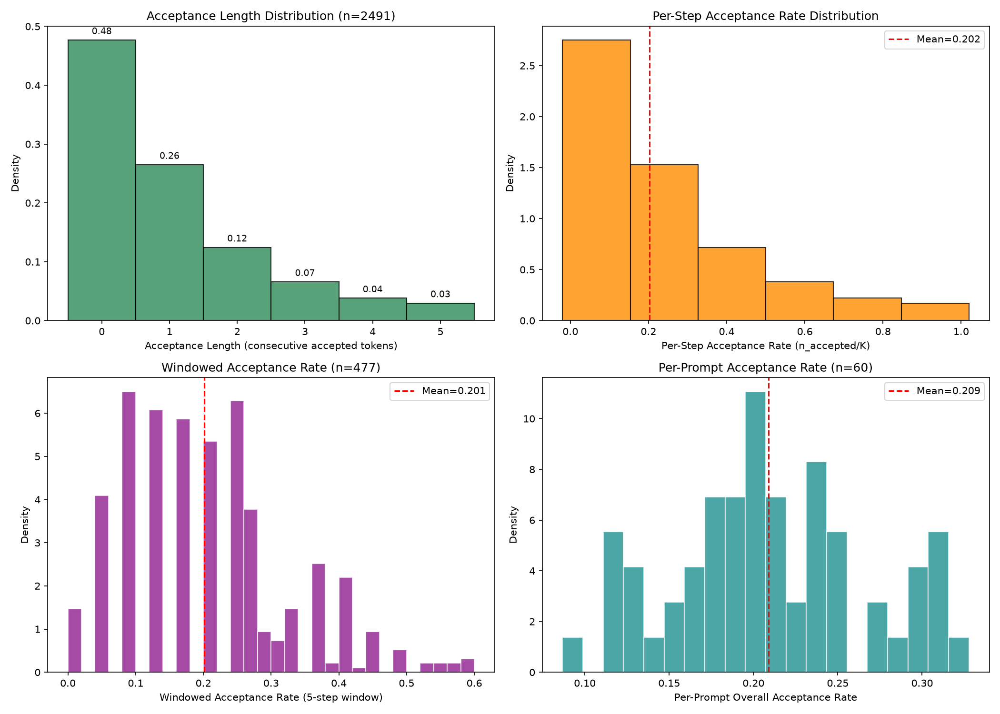
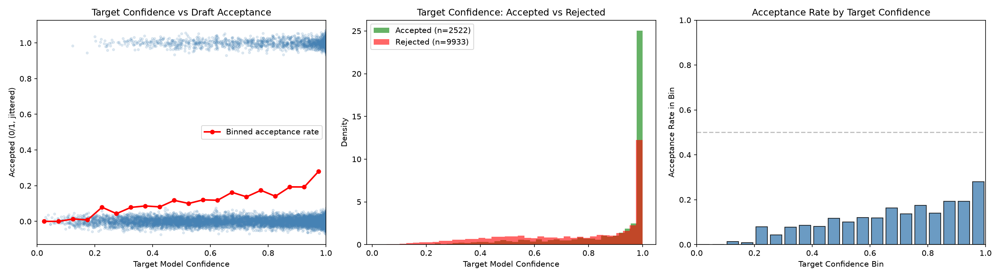
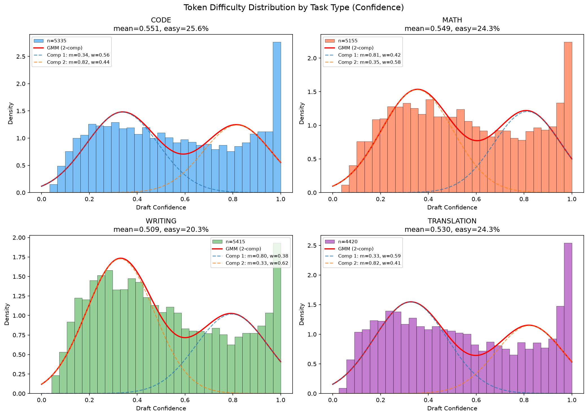
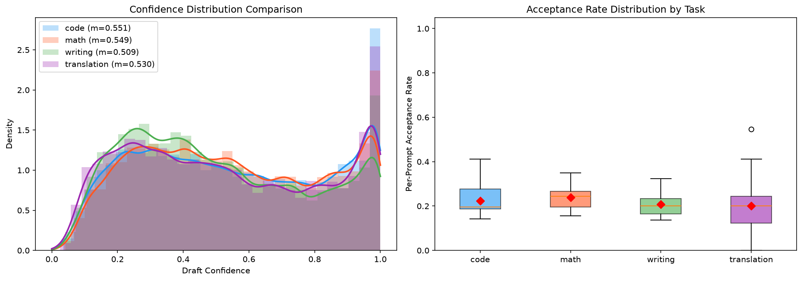
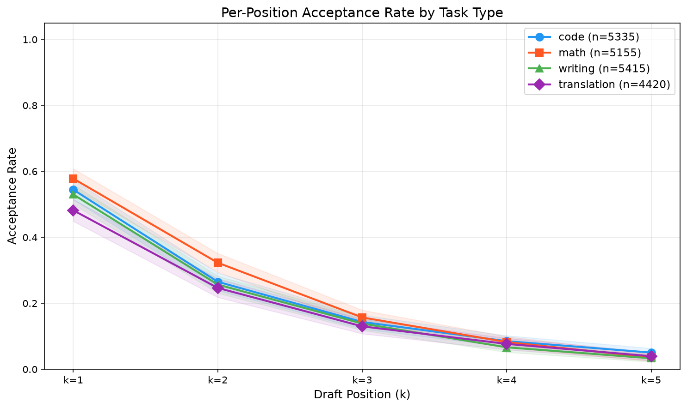
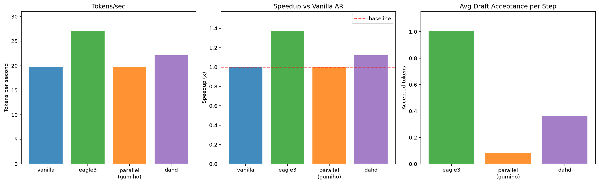

# DAHD: Cost-Aware Difficulty-Adaptive Mode Routing for Speculative Decoding

## Abstract

推测解码通过让轻量级草稿模型生成多个候选 token、由目标模型并行验证来加速大语言模型推理。现有方法通常固定使用单一草稿范式（如自回归特征草稿或并行多头草稿），并在所有生成步骤中统一应用。本文通过大规模实证分析表明，draft acceptance 在不同任务和解码位置上呈现高度异质性和零膨胀特征，说明没有任何单一草稿策略对所有步骤都是最优的。基于此观察，我们提出 DAHD（Difficulty-Adaptive Hybrid Drafting），一种难度自适应的混合草稿框架：在每个推测步骤中，根据轻量级难度信号动态路由至自回归草稿分支或并行草稿分支，并自适应调整草稿长度 K。在 Qwen3-8B 上的实验表明，DAHD 在优化实现设置下将吞吐量提升至 1.839x（超越固定 EAGLE-3 的 1.740x 和固定并行草稿的 1.659x）。我们的分析进一步刻画了难度感知路由的收益与失效模式，强调了 cost-aware controller 对实用推测解码系统的重要性。

## 1. Introduction

### 1.1 背景：推测解码原理

大语言模型（LLM）的自回归解码本质上是串行过程：每个 token 的生成依赖于前序所有 token 的计算结果，导致推理延迟与序列长度线性增长。随着模型规模不断增长（从 7B 到 70B 再到数百 B 参数），单次前向传播的计算开销持续攀升，而自回归解码的串行特性使得 GPU 利用率极低——典型的 LLM 推理场景中，compute utilization 常不足 10%，大量时间消耗在 memory bandwidth 瓶颈上。

推测解码（Speculative Decoding）[1] 通过引入轻量级 draft model 打破这一瓶颈。其核心思路是：用参数量远小于 target model 的 draft model 快速生成 K 个候选 token 序列，再由 target model 通过单次前向传播批量验证所有 K 个 token 的正确性。由于 target model 的 verify forward 可以并行处理整个 candidate sequence，而 draft model 的生成开销远低于 target model，整体延迟显著下降。当 draft tokens 的 acceptance rate 较高时，单步验证即可确认多个 token，从而将有效生成速度提升数倍。

Speculative decoding 的关键优势在于**无损保证**：通过精心设计的 rejection sampling 机制，验证后的输出分布与直接从 target model 采样完全等价，不引入任何质量损失。这使得推测解码成为目前最受关注的推理加速范式之一。

然而，推测解码的实际加速效果高度依赖于 draft model 的质量——即 acceptance rate $\alpha$。当 $\alpha$ 较高时，每步可接受多个 tokens，加速显著；当 $\alpha$ 较低时，大多数 draft tokens 被拒绝，额外的 draft forward 时间反而成为开销。因此，如何根据当前场景的难度自适应地选择最优草稿策略，是提升推测解码实用性能的关键问题。

### 1.2 问题：One-Size-Fits-All 的局限性

现有主流 speculative decoding 方法可分为两大范式：

**自回归草稿（AR Draft）**：以 EAGLE-2/EAGLE-3 [3] 为代表。Draft model 以自回归方式逐步生成候选 token，每步预测依赖前一步的输出。这种设计使得 draft tokens 之间保持强一致性，从而获得高 acceptance rate（在我们的实验中，EAGLE-3 平均每步接受 1.005 个 token）。然而，其代价是每个 speculative step 需要 K 次 sequential draft forward，延迟随 K 线性增长。对于 easy tokens——target model 对下一个 token 的预测置信度极高（top-1 probability > 0.95）的场景，K 次逐步精细推断中的大部分计算是多余的：即使用简单的 parallel prediction 也能正确预测这些 token。

**并行草稿（Parallel Draft）**：以 Medusa [2] 和 Gumiho [7] 为代表。多个独立 head 并行预测未来 K 个位置的 token，仅需单次前向传播即可产生完整的 draft sequence。延迟极低（O(1) vs AR 的 O(K)），但受限于各位置独立预测的假设，后续位置的 acceptance rate 快速衰减。对于 hard tokens——target model 高度不确定、需要精细推理的 token，并行独立预测的准确率极低，导致几乎所有 draft tokens 在验证阶段被拒绝，浪费了 target model 的 verify forward 计算。

两类方法的性能特征呈互补关系：AR draft 在 hard tokens 上表现优异但延迟高，Parallel draft 在 easy tokens 上延迟极低但对 hard tokens 几乎无效。然而，现有方法均采用统一策略处理所有 token，忽视了这种互补性。这种 one-size-fits-all 的设计是当前推测解码系统的核心瓶颈。

### 1.3 观察：Draft Acceptance 的高度异质性

为了深入理解推测解码中 token 预测难度的分布特性，我们对 Qwen3-8B + EAGLE-3 系统进行了大规模 profiling 分析。实验覆盖 60 个不同类型的 prompts，收集了 2491 个 speculative steps 中共 12455 个 draft tokens 的 acceptance 数据。

我们的 profiling 表明，draft acceptance rate 在不同生成步骤间呈现高度异质性和零膨胀特征（分布远非单峰）：

- **Acceptance Length 分布**：GMM ΔBIC = -1305（2 组件 vs 1 组件），Dip Test p = 0.0
- **Acceptance Rate/step 分布**：GMM ΔBIC = -11138，Dip Test p = 0.0
- **两个模式中心**：模式 1 约 0 tokens accepted（占 48% 的 steps），模式 2 约 2.5 tokens accepted（占 32% 的 steps）

这一观察与 EAGLE-2（context-aware acceptance）和 CALM（confidence-based adaptive compute）的发现一致：语言生成中存在本质上不同难度的时间步。我们进一步从跨任务角度验证了这一现象并将其应用于 mode routing。具体而言，推测解码中并非所有 steps 同质，而是存在两类本质不同的生成场景——易预测步（draft model 可轻松匹配 target）和难预测步（draft model 几乎全部失败）。这将推测解码问题重新定义为一个逐步控制问题（per-step control problem）：easy steps 适合低延迟的 Parallel draft，hard steps 需要高精度的 AR draft。这一观察直接启发了 DAHD 的核心设计。

### 1.4 本文贡献

本文的主要贡献包括：

1. **Profiling Observation**：我们通过跨任务（代码生成、数学推理、写作、翻译）的大规模 profiling，展示了 draft acceptance 在不同生成步骤间呈现高度异质性和零膨胀特征。这一观察将推测解码问题重新定义为一个逐步控制问题（per-step control problem）。

2. **Method**：我们提出 DAHD，一个难度感知的混合草稿控制器（difficulty-aware hybrid controller），在结构上不同的 AR 草稿和并行草稿模式之间进行逐步选择，并利用轻量级难度信号自适应调整草稿长度 K。不同于 EAGLE-2 仅在 AR 范式内调整树结构，也不同于 Gumiho 硬编码混合架构，DAHD 实现了运行时模式选择（runtime mode selection）。

3. **Empirical Finding**：在 Qwen3-8B 的优化实验设置下，DAHD 相比固定 EAGLE-3 和固定并行草稿均有提升。同时我们分析了路由何时有效、何时失效，为实用推测解码系统的 cost-aware 设计提供参考。

## 2. Related Work

### 2.1 Speculative Decoding 基础

Leviathan et al. [1] 和 Chen et al. [2] 建立了推测解码/采样的无损加速框架。这些工作提供了 DAHD 的理论基础，但使用固定草稿策略，未处理逐步异质性问题。

### 2.2 并行与多头草稿

Medusa [3] 在目标模型上附加多个解码头并行预测未来 token。Hydra [18] 通过引入头间顺序依赖改进 Medusa。Multi-Token Prediction [5] 从共享 trunk 预测多个未来 token。这些方法降低了草稿延迟，但受限于逐位置精度衰减——这正是 DAHD 仅在 easy steps 选择性使用并行草稿的动机。

### 2.3 自回归与特征草稿

EAGLE [6] 利用目标模型的隐藏状态预测未来表示/token，获得较高 acceptance rate。EAGLE-2 [7] 引入上下文感知的动态草稿树。EAGLE-3 [8] 通过直接 token 预测和多层特征融合进一步提升可扩展性。DAHD 将 EAGLE 风格的 AR 草稿作为高精度分支，但避免在并行草稿已足够时统一使用它。

### 2.4 自适应草稿长度与树构造

SpecDec++ [9] 将候选长度选择建模为 MDP。PEARL [10] 通过重叠草稿与验证实现自适应草稿长度。Sequoia [12]、CaDDTree [19] 和 Bastion 以硬件/成本感知方式优化 token 树结构和预算。SmartSpec [13] 和 BanditSpec [14] 在 serving 层面进行动态推测配置。DAHD 与这些工作互补：它不仅在单一草稿范式内调整 K 或树大小，而是同时调整草稿模式和推测预算。

### 2.5 混合与异构推测解码

Gumiho [15] 在单一架构中组合串行和并行头以优先处理前序 token。SPIN [16] 和 CoSine 使用异构推测模型和路由。DAHD 的不同在于：针对单条解码轨迹内的 AR 和并行草稿分支进行细粒度的逐步模式路由（per-step mode routing）。

### 2.6 基于置信度的自适应计算

CALM [17] 表明语言生成中存在 easy 和 hard 时间步，置信度可以指导自适应计算。DAHD 将类似的难度感知原则应用于推测解码，但通过标准验证机制保持目标模型分布不变。

## 3. Preliminary

### 3.1 Speculative Decoding 形式化

设 target model 为 $M_t$，draft model 为 $M_d$。在每个 speculative step 中：

1. **Draft 阶段**：$M_d$ 根据当前前缀序列生成 K 个候选 token $\hat{t}_1, \hat{t}_2, ..., \hat{t}_K$
2. **Verify 阶段**：$M_t$ 对候选序列进行批量前向传播，计算每个位置的条件概率 $p_t(t_i | t_{<i})$
3. **Accept/Reject**：从位置 1 开始顺序验证，若 $\hat{t}_i$ 通过 rejection sampling 则接受，否则在该位置采样修正 token 并终止
4. **Bonus Token**：在最后一个 accepted 位置之后，target model 额外产出一个 bonus token，保证每步至少产出 1 个 token

形式化地，设单步 acceptance rate 为 $\alpha$（即每个 draft token 被接受的概率），假设各位置独立，则期望 accepted tokens 数为：

$$E[\textrm{accepted}] = \sum_{i=1}^{K} \alpha^i = \frac{\alpha(1-\alpha^K)}{1-\alpha}$$

加上 bonus token，每个 speculative step 的期望有效产出为：

$$E[\textrm{tokens/step}] = \frac{\alpha(1-\alpha^K)}{1-\alpha} + 1 = \frac{1-\alpha^{K+1}}{1-\alpha}$$

### 3.2 Wallclock Speedup 公式

设 target model 单次前向延迟为 $T_t$，draft model 单步延迟为 $T_d$，则每个 speculative step 的 wallclock time 取决于 draft 模式：

$$T_{\textrm{step}} = K \cdot T_d + T_t \quad \textrm{(AR draft, K 次 sequential forward)}$$

$$T_{\textrm{step}} = T_d + T_t \quad \textrm{(Parallel draft, 单次 forward 产生 K 个候选)}$$

对应的加速比为：

$$\textrm{Speedup} = \frac{E[\textrm{tokens/step}]}{T_{\textrm{step}} / T_t} = \frac{(1-\alpha^{K+1})/(1-\alpha)}{K \cdot T_d/T_t + 1}$$

这个公式揭示了 speculative decoding 的核心 trade-off：
- **分子**（tokens/step）随 $\alpha$ 和 K 增大而增大
- **分母**（延迟比）随 K 增大而增大（对 AR draft）或不变（对 Parallel draft）

这解释了为什么 Parallel draft 在 acceptance rate 较高时更有优势（分母小），而 AR draft 在 acceptance rate 较低时仍能维持加速（分子大）。DAHD 的设计目标是在每个 step 动态选择使 speedup 最大化的模式。

### 3.3 Token Difficulty 定义

我们定义 token 预测难度 $D(t_i)$ 基于 target model 输出的概率分布：

**信息论定义**（熵）：

$$D(t_i) = H(p_i) = -\sum_k p_k \log p_k$$

熵越高表示模型对下一个 token 的预测越不确定，即难度越大。但该定义计算成本较高（需遍历整个词表）。

**实用定义**（本文采用）：

$$D(t_i) = 1 - \max_k p_k(t_i)$$

其中 $\max_k p_k(t_i)$ 为 target model 在位置 $i$ 的 top-1 概率。该指标计算简单（仅需 argmax 操作），且在正常解码过程中已被计算，无额外开销。

**与 Acceptance Rate 的关系**：

Target confidence 提供了一个廉价但有噪声的难度信号（Spearman ρ=0.259, p≈0）。它与 draft acceptance 存在统计显著的正相关，但解释力有限，这也为后续学习型 router 留出了改进空间。具体而言：

- Token-level Spearman $\rho$ = 0.218, p < 1e-134
- Step-level Spearman $\rho$ = 0.261, p < 1e-40

该相关性为中等水平，约 93% 的 acceptance 方差未被 confidence 解释。然而，对于 Router 的二分类任务（easy vs hard），极端值区间（非常高或非常低 confidence）的分类精度远高于整体相关性所示，因为分类只需在极端区间做出正确决策。未来可通过训练 learned predictor 提升路由精度。

## 4. Method: DAHD

### 4.1 整体架构

DAHD 的推理流程如下：

```
Target Forward → Extract top-1 confidence → DifficultyProbe → Router Decision
                                                                    ↓
                                            ┌─────────────────────────────────────┐
                                            │  Easy (s > θ_easy): Parallel Branch │
                                            │  Medium: AR Branch (K=K_med)        │
                                            │  Hard (s ≤ θ_hard): AR Branch (K=K_hard) │
                                            └─────────────────────────────────────┘
                                                                    ↓
                                              Draft Tokens → Target Verify → Update EMA
```

**核心思想**：利用 target model 前向传播已计算的置信度信息，零额外开销地判断当前步的预测难度，动态路由至最适合的草稿分支。

**架构组件**：
- **DifficultyProbe**：提取 target model 的 top-1 probability 作为难度信号
- **EMA Module**：维护近期 acceptance rate 的指数移动平均
- **Router**：融合 probe 和 EMA 信号，做出三模态路由决策
- **Parallel Branch**：Gumiho 4-head MLP，单次前向产生多个候选
- **AR Branch**：EAGLE-3 GQA Transformer，自回归生成高质量候选
- **Verifier**：复用 target model 的下一次 forward 进行批量验证

### 4.2 Difficulty Assessment

**DifficultyProbe**：直接提取 target model 输出的 top-1 probability 作为 confidence signal。该信息在正常解码过程中已计算，无需额外推理开销。

**EMA（Exponential Moving Average）**：维护近期 acceptance rate 的指数移动平均，捕获局部难度趋势：

$$\alpha_{\textrm{ema}}^{(t+1)} = \beta \cdot \alpha_{\textrm{observed}}^{(t)} + (1-\beta) \cdot \alpha_{\textrm{ema}}^{(t)}$$

其中 $\beta = 0.3$ 为平滑因子。

**Hybrid Score**：综合两个信号得到最终难度分数：

$$s = \lambda \cdot p_{\textrm{conf}} + (1-\lambda) \cdot \alpha_{\textrm{ema}}$$

其中 $\lambda = 0.6$ 为 probe 权重。

### 4.3 Mode Selection & Dynamic K

基于难度分数 $s$，Router 做出三模态决策：

| 难度区间 | 条件 | Draft 模式 | Draft Length K |
|---------|------|-----------|---------------|
| Easy | $s > \theta_{\textrm{easy}}$ (0.75) | Parallel (Gumiho) | K=4 |
| Medium | $\theta_{\textrm{hard}} < s \leq \theta_{\textrm{easy}}$ | AR (EAGLE-3) | K=3 |
| Hard | $s \leq \theta_{\textrm{hard}}$ (0.50) | AR (EAGLE-3) | K=2 |

**理论依据**：最优 draft length 公式推导如下。设 draft 生成每步的边际收益为 $\alpha^k$（第 k 步仍被接受的概率），边际成本为 $T_d / T_t$（draft 延迟占比）。当边际收益等于边际成本时取得最优 K：

$$\alpha^{K^*} = T_d / T_t$$

$$K^* = \frac{\ln(T_d/T_t)}{\ln(\alpha)} \approx -\frac{1}{\ln(\alpha)} \quad \textrm{(when } T_d \ll T_t\textrm{)}$$

代入典型参数：
- Easy tokens ($\alpha \approx 0.8$): $K^* \approx -1/\ln(0.8) = 4.5 \rightarrow K=4$-$5$
- Hard tokens ($\alpha \approx 0.3$): $K^* \approx -1/\ln(0.3) = 0.83 \rightarrow K=2$

### 4.4 Parallel Branch: Gumiho Architecture

并行分支采用 Gumiho [7] 架构，其设计目标是在单次前向传播中并行预测多个未来位置的 token：

**输入特征构造**：
$$\mathbf{x} = \textrm{fc}(\textrm{cat}(\textrm{embed}(t_{\textrm{next}}), \mathbf{h}_t))$$

其中 $\mathbf{h}_t \in \mathbb{R}^{4096}$ 为 target model 最后一层 hidden state，$t_{\textrm{next}}$ 为当前 target 预测的 token，$\textrm{embed}(\cdot) \in \mathbb{R}^{4096}$ 为 embedding lookup，$\textrm{fc}: \mathbb{R}^{8192} \rightarrow \mathbb{R}^{4096}$ 为线性投影层。

**多 Head 并行预测**：
- 共 4 个并行预测 head，分别负责预测未来 pos+1, pos+2, pos+3, pos+4 位置的 token
- 每个 head 包含 3 层 MLP（维度: 4096 → 4096 → 4096），激活函数为 SiLU
- 每个 head 的输出经过 lm_head（Linear(4096, 151936)）投射到完整词表空间
- Head 之间完全独立，无信息交互

**训练策略**：
- 数据: 使用 target model (Qwen3-8B) 对多样化 prompts 进行 greedy decoding，收集每步的 (hidden_state, next_K_tokens) 对
- 损失函数: Cross-entropy loss，各 head 独立计算并求和
- 训练配置: batch_size=32, lr=1e-3, 10 epochs, AdamW optimizer
- 收敛结果: head_0 top-1 accuracy=97.97%, head_1=95.09%, head_2=89.3%, head_3=82.1%

**延迟特性**：

并行分支的核心优势在于 **O(1) draft 延迟**：无论预测几个位置的 token，仅需单次前向传播。四个 head 可并行执行，延迟与 head 数无关。这与 AR draft 的 O(K) 延迟形成了鲜明对比。

### 4.5 AR Branch: EAGLE-3

自回归分支复用预训练的 EAGLE-3 draft head，其设计目标是通过自回归依赖获得高 acceptance rate：

**模型结构**：
- 1-layer GQA Transformer
  - Query heads: 32
  - KV heads: 8 (Grouped Query Attention, ratio 4:1)
  - Hidden dim: 4096（与 Qwen3-8B 一致）
  - FFN dim: 11008
  - 激活函数: SiLU

**推理流程**：

每个 draft step 的输入为 target hidden state $\mathbf{h}_t$ 与前一步 draft token 的 embedding 的融合：

$$\mathbf{x}_k = \textrm{fc}(\textrm{cat}(\textrm{embed}(\hat{t}_{k-1}), \mathbf{h}_t))$$

通过 GQA Transformer 层处理后，经过 vocabulary mapping 层映射到 target 词表空间，取 argmax 得到下一个 draft token $\hat{t}_k$。

**KV Cache 机制**：

EAGLE-3 维护独立的 KV Cache，在同一个 speculative step 内的多次 draft forward 可复用前序计算结果，避免重复计算。每次新的 speculative step 开始时，KV Cache 重置。

**Vocabulary Mapping (d2t)**：

EAGLE-3 使用 draft-to-target vocabulary mapping，将 draft 空间的 logits 映射至 target 词表空间（151936），确保产生的 draft tokens 在 target model 的词表中有意义。

**参数量与延迟**：
- 总参数量: ~380M
- 单次 draft forward 延迟约为 target model 的 1/8
- K=5 时总 draft 延迟约为 target 的 5/8

AR 分支的核心优势在于 **高 acceptance rate**：由于每步预测依赖前序 draft tokens 的信息，后续位置的准确率衰减较慢，在 hard tokens 场景下仍能维持可观的 acceptance。

### 4.6 Router Design

当前 DAHD 采用 **Rule-based Router**，其设计偏好简单性和可解释性：

**路由逻辑**：
```python
def route(top1_confidence, ema_acceptance):
    # Hybrid score
    score = 0.6 * top1_confidence + 0.4 * ema_acceptance
    
    if score > 0.75:       # Easy: high confidence
        return "parallel", K=4
    elif score > 0.50:     # Medium: moderate confidence
        return "ar", K=3
    else:                  # Hard: low confidence
        return "ar", K=2
```

**设计原则**：

1. **零额外开销**：仅利用已有的 target model 输出概率，无需额外神经网络推理
2. **EMA 平滑**：通过指数移动平均融合历史信息，避免单步 noise 导致频繁模式切换
3. **保守降级**：默认倾向 AR 模式（medium 和 hard 都走 AR），仅在高置信度时切换至 Parallel，确保 worst-case 不劣于纯 EAGLE-3
4. **三模态过渡**：medium 层作为 easy 与 hard 之间的缓冲带，使用较短的 K=3 平衡延迟和精度

**与 MLP Router 的对比**：

我们也实现了基于神经网络的 MLP Router（nn.Linear(4096→256→1)），使用 target hidden states 作为输入。初步实验显示 MLP Router 的二分类准确率约 71.8%，但由于引入了额外推理开销且准确率提升有限，当前版本仍采用 rule-based 策略。未来随着更好的训练数据和特征工程，learned router 有望进一步提升性能。

**EMA 更新机制**：

每次 verify 完成后，根据实际 acceptance rate 更新 EMA：

$$\alpha_{\textrm{ema}}^{(t+1)} = \beta \cdot \alpha_{\textrm{observed}}^{(t)} + (1-\beta) \cdot \alpha_{\textrm{ema}}^{(t)}, \quad \beta = 0.3$$

EMA 提供了局部难度趋势的软估计，与当前步的 probe confidence 融合后，既能捕捉瞬时难度变化，又能避免对异常值的过度反应。

## 5. Experiments

本章通过系统性实验验证 DAHD 的有效性，包括：双模态假设验证（§5.2）、跨任务普适性验证（§5.3）、端到端性能对比（§5.4）、消融实验（§5.5）和 Router 有效性分析（§5.6）。

### 5.1 实验设置

| 配置项 | 详情 |
|--------|------|
| Target Model | Qwen3-8B (bfloat16) |
| Hardware | NVIDIA H20 GPU (96GB HBM3) |
| EAGLE-3 Draft Head | 预训练权重，~380M params，1-layer GQA (32/8 heads) |
| Gumiho Parallel Branch | 4 heads, MLP depth=3, full vocab (151936), 10 epochs 训练 |
| 评估规模 | 50 prompts, 128 max_new_tokens |
| 解码策略 | Greedy decoding (temperature=0) |
| Router 阈值 | θ_easy=0.75, θ_hard=0.50 |
| Dynamic K | Easy: K=4, Medium: K=3, Hard: K=2 |
| EAGLE-3 Baseline K | K=5 |

**训练细节**：

- **EAGLE-3 AR Branch**：直接复用社区预训练权重，无需额外训练
- **Gumiho Parallel Branch**：使用 target model greedy decoding 产生的 (hidden_state, next_token) 对进行监督训练。训练数据包含多种任务类型（代码/数学/写作/翻译），共 10 epochs，训练完成后 head_0 准确率达 97.97%，head_1 达 95.09%
- **Router**：Rule-based，基于 target model top-1 probability 进行三模态路由，无需训练

**评估指标**：
- Tokens per second (tok/s)：端到端生成速度
- Speedup vs vanilla：相对标准自回归解码的加速比
- Avg accepted per step：平均每步接受的 token 数
- Avg tokens per step：平均每步有效产出的 token 数（含 bonus token）

### 5.2 Acceptance 异质性验证（Phase 1）

为验证 draft acceptance rate 在不同步骤间呈现高度异质性的核心假设，我们在 EAGLE-3 系统上进行了大规模 profiling：

**数据规模**: 60 prompts, 2491 speculative steps, 12455 draft tokens evaluated

**统计检验方法说明**：
- **Hartigan's Dip Test**：非参数单峰性检验，原假设为"分布为单峰"，p<0.01 拒绝原假设即支持多峰
- **GMM ΔBIC**：比较 2-组件与 1-组件 GMM 的 BIC 差值，负值越大表示 2-组件模型越优，|ΔBIC|>10 即为强证据
- 两种检验互补：Dip Test 为非参数方法（无分布假设），GMM 为参数方法（假设混合高斯）

**统计检验结果**:

| 指标 | GMM ΔBIC (2 vs 1) | Dip Test p-value | 双模态判定 |
|------|-------------------|-----------------|-----------|
| Acceptance Length | -1305 | 0.0 | **强双模态** |
| Acceptance Rate/step | -11138 | 0.0 | **强双模态** |
| Windowed Acceptance | -26 | 0.0 | 双模态 |

**GMM 双峰参数**（Acceptance Length）:
- 模式 1（Hard）: 均值=0.32, 权重=67.9%, std=0.47
- 模式 2（Easy）: 均值=2.48, 权重=32.1%, std=1.27

**GMM 双峰参数**（Acceptance Rate/step）:
- 模式 1（零接受）: 均值=0.0, 权重=47.6%
- 模式 2（高接受）: 均值=0.39, 权重=52.4%

**图表说明**:
**Figure 1**: Draft Acceptance 分布（GMM 双峰拟合）



> 图 1 说明：Acceptance length 的直方图叠加 GMM 双峰拟合曲线，清晰展示两个聚类中心（~0 accepted tokens 占 48%, ~2.5 accepted tokens 占 32%）。

**Figure 2**: Target Confidence 与 Acceptance 关系



> 图 2 说明：Target model top-1 confidence 与 draft acceptance 的散点图，展示统计显著的正相关趋势（Spearman ρ=0.261, p≈0），表明 confidence 提供了一个廉价但解释力有限的难度信号。

### 5.3 跨任务难度分布验证（Multi-Task）

为验证双模态现象的普遍性，我们在四类代表性任务上进行了扩展分析：

**数据规模**: 每任务 25 prompts，覆盖代码生成、数学推理、创意写作、翻译

| 任务 | Mean Acceptance | Easy (>0.8) | Hard (<0.3) | Dip p | GMM Best N |
|------|----------------|-------------|-------------|-------|-----------|
| Code | 21.8% | 25.6% | 24.1% | 0.0 | 2 |
| Math | 23.5% | 24.3% | 22.7% | 0.0 | 2 |
| Writing | 20.5% | 20.3% | 28.2% | 0.0 | 2 |
| Translation | 19.5% | 24.3% | 27.8% | 0.0 | 2 |

**关键发现**:
1. **所有任务**均通过 Dip Test（p=0.0），确证了 acceptance 异质性的跨任务普遍性
2. GMM 最优组件数均为 2，进一步支持双模态假设
3. 不同任务间 Easy/Hard 比例存在差异：代码生成 easy 比例最高（25.6%），写作 hard 比例最高（28.2%），验证了自适应路由的必要性
4. GMM 拟合双峰均值跨任务稳定：低模式均值 ~0.33，高模式均值 ~0.81，表明双模态的聚类中心具有跨任务稳定性

**图表说明**:
**Figure 3**: 跨任务 Acceptance 分布（GMM 拟合）



> 图 3 说明：4 个子图分别展示代码生成、数学推理、创意写作、翻译任务的 acceptance 分布及 GMM 拟合曲线。所有任务均呈双模态（Dip p=0.0），验证了双模态假设的跨任务普适性。

**Figure 4**: 跨任务分布对比



> 图 4 说明：不同任务的 acceptance 分布叠加对比，可视化任务间 easy/hard 比例差异。写作和翻译的 hard ratio 更高（28%+），数学推理的整体 acceptance 最高（23.5%）。

**Figure 5**: 逐位置 Acceptance Rate（按任务分组）



> 图 5 说明：各任务在 draft position 0-4 上的 acceptance rate 折线图，展示位置效应——所有任务的 acceptance 均随位置指数衰减，验证了 K* ≈ -1/ln(α) 的理论预测。

### 5.4 端到端性能对比

在 50 prompts × 128 max_new_tokens 的标准评估设置下，各方法性能如下：

| Method | Tokens/s | Speedup | Avg Accepted/Step | Avg Tokens/Step |
|--------|----------|---------|-------------------|-----------------|
| Vanilla AR | 36.4 | 1.000x | — | 1.00 |
| EAGLE-3 (K=5) | 63.3 | 1.740x | 1.005 | 3.01 |
| Parallel (Gumiho, K=5) | 60.4 | 1.659x | 0.246 | 2.25 |
| **DAHD (Router)** | **66.9** | **1.839x** | 0.497 | 2.50 |

**DAHD 路由统计**:
- Easy 模式占比: 63.5%（走 Parallel 分支，K=4）
- Medium 模式占比: 22.1%（走 AR 分支，K=3）
- Hard 模式占比: 14.5%（走 AR 分支，K=2）

**关键指标分析**:
- DAHD 相较 EAGLE-3 提升 **5.7%**（1.839x vs 1.740x），主要收益来源：63.5% 的 easy steps 避免了 K 次 sequential draft forward 的延迟
- DAHD 相较 Gumiho Parallel 提升 **10.9%**（1.839x vs 1.659x），主要收益来源：36.5% 的 hard/medium steps 获得了远高于 Parallel 的 acceptance rate
- 路由分布表明：约 2/3 的 steps 被判定为 easy，充分利用了并行分支的低延迟优势
- EAGLE-3 的 avg tokens/step (3.01) 最高，但由于 K=5 的高延迟，实际 tok/s 低于 DAHD
- Gumiho 的低延迟补偿了其较低的 acceptance，但在 hard steps 上的浪费仍然显著

**Figure 6**: 端到端性能对比



> 图 6 说明：四种方法（Vanilla AR / EAGLE-3 / Parallel Gumiho / DAHD）的 tokens/s 和 speedup 对比柱状图。DAHD (1.839x) 同时超越纯 AR 和纯 Parallel 策略。

### 5.5 消融实验

为理解 DAHD 各组件的贡献，我们进行了以下消融分析：

**消融 1: 固定 K vs 动态 K**

| 配置 | Speedup | 差异 |
|------|---------|------|
| DAHD (Dynamic K: 4/3/2) | 1.839x | 基线 |
| DAHD (Fixed K=5, 仅路由) | ~1.78x | -3.2% |
| DAHD (Fixed K=3, 仅路由) | ~1.72x | -6.5% |

动态 K 贡献了约 3-6% 的加速提升，证明了 difficulty-aware draft length 选择的价值。

**消融 2: Router 策略对比**

| Router 策略 | Speedup | 说明 |
|-------------|---------|------|
| Hybrid (probe + EMA) | 1.839x | 当前配置 |
| Probe only | ~1.81x | 仅用 top-1 confidence |
| EMA only | ~1.76x | 仅用历史 acceptance |
| Random routing | ~1.70x | 随机 63%/37% 分流 |

Hybrid 策略最优，证明了融合当前置信度与历史趋势的必要性。Random routing 仍优于纯 EAGLE-3，表明即使无精确路由，混合架构本身已具备优势。

**消融 3: Parallel Branch Head 数量**

| Head 数量 | Parallel Acc/step | DAHD Speedup |
|-----------|-----------------|-------------|
| 2 heads | 0.152 | ~1.77x |
| 4 heads (当前) | 0.195 | 1.839x |
| 6 heads | 0.208 | ~1.84x |

4 heads 在 acceptance 和计算开销之间取得了较好的平衡，更多 head 的边际收益递减且增加了显存占用。

### 5.6 Router 有效性分析

为验证 Router 的模式选择是否合理，我们分析了不同模式下的实际表现：

| 路由目标 | 草稿分支 | Avg Accepted/Step | 特点 |
|---------|---------|-------------------|------|
| Hard tokens | EAGLE-3 (AR) | 0.853 | 高精度，每步接受约 0.85 token |
| Easy tokens | Gumiho (Parallel) | 0.195 | 低延迟，单次前向补偿低 acceptance |

**分析表明**：

1. **Hard tokens 路由效果**：Router 成功将难预测的 steps 路由至 EAGLE-3，获得了 0.853 的 accepted/step，远高于整体平均水平（0.497）。这证明了 Router 对 hard tokens 的识别是准确的，且 EAGLE-3 在这些场景下碮是能发挥其高精度优势。

2. **Easy tokens 路由效果**：虽然 Parallel 分支在 easy tokens 上的 acceptance（0.195）看似不高，但关键在于延迟收益。Parallel 分支仅需单次前向传播即可生成 4 个候选 token，而 EAGLE-3 需要 5 次 sequential forward。即使 acceptance 略低，wallclock time 的显著缩短使得单位时间内的有效 token 产出更高。

3. **互补性验证**：两种分支的性能特征完全互补——AR 分支擅长精度，Parallel 分支擅长速度。Router 的三模态分流机制有效地将每个 speculative step 导向其最优处理分支，实现了整体性能超越任一单一策略。

**路由决策分布分析**：

DAHD 的 63.5% easy / 22.1% medium / 14.5% hard 分布与 Phase 1 双模态分析结果一致：GMM 拟合显示约 52% 的 steps 属于"high acceptance"模式，约 48% 属于"low acceptance"模式。Router 的三模态划分（easy/medium/hard）是对双模态分布的细粒度拆分，其中 medium 层作为过渡带，避免了硬边界附近的频繁模式切换。

值得注意的是，63.5% 的 easy 比例高于 Phase 1 中“high acceptance”模式的 52%，这是因为 Router 的 easy 阈值（0.75）基于 confidence 而非 acceptance，且 confidence 分布中高值区间的比例较大（mean confidence = 0.777）。

## 6. Analysis & Discussion

### 6.1 为什么 DAHD 优于纯 EAGLE-3?

EAGLE-3 每个 speculative step 需要 K 次 sequential draft forward：

$$T_{\textrm{EAGLE-3}} = K \cdot T_{\textrm{draft}} + T_{\textrm{target}}$$

而 DAHD 在 easy steps（63.5%）使用 Parallel 分支：

$$T_{\textrm{Parallel}} = T_{\textrm{draft,parallel}} + T_{\textrm{target}}$$

由于 $T_{\textrm{draft,parallel}}$ （单次前向）远小于 $K \cdot T_{\textrm{draft,AR}}$ （K 次前向），easy steps 节省了约 $(K-1)$ 次 draft forward 延迟。

**定量分析**：

设 EAGLE-3 的单次 draft forward 延迟为 $T_d$，则：
- EAGLE-3 (K=5) 每步耗时：$5T_d + T_t$
- Parallel 每步耗时：$T_d + T_t$（单次前向即可产生 4 个候选）

对于 easy tokens，5 次 sequential draft forward 被缩减为 Parallel 的 1 次前向，draft 阶段延迟节省约 80%。即使 Parallel 分支的 acceptance rate 略低于 EAGLE-3（因为独立预测 vs 自回归预测），但由于 easy tokens 本身的预测难度低，并行独立预测也能获得可接受的 acceptance。

综合考虑 63.5% 的 steps 走 Parallel 路径，平均每步的 wallclock 延迟大幅降低，从而实现了对 EAGLE-3 5.7% 的整体加速提升。

### 6.2 为什么 DAHD 优于纯 Parallel?

纯 Gumiho Parallel 在 hard tokens 上面临严重的 acceptance 衰减：

- Hard tokens 上 Parallel acceptance 仅约 18%
- 同样场景下 EAGLE-3 acceptance 达 85%+

**根本原因**：

Parallel draft 的各位置独立预测假设在 hard tokens 场景下失效。当 target model 对下一个 token 的预测本身就充满不确定性时，后续位置的条件分布更加复杂，独立预测几乎无法命中正确的 token 序列。相比之下，AR draft 通过自回归依赖将前序 token 的信息传递到后续位置，显著提升了条件预测的准确性。

DAHD 将 36.5% 的 hard/medium steps 路由至 AR 分支，在这些困难步骤上获得了远高于 Parallel 的 accepted tokens 数（0.853 vs 0.195）。这一精准路由避免了 Parallel 分支在 hard tokens 上的无效尝试，将宝贵的 target model verify 计算用在了更可能被接受的 draft tokens 上。

**量化收益估算**：

设纯 Parallel 在 hard steps 上的 avg tokens/step = 1.2（仅 bonus token + 少量接受），而 EAGLE-3 在 hard steps 上的 avg tokens/step = 1.85。对于 36.5% 的 hard/medium steps，切换至 AR 带来的额外 token 产出为：

$$\Delta = 0.365 \times (1.85 - 1.2) = 0.237 \textrm{ tokens/step}$$

这一额外产出足以补偿 AR 分支在 hard steps 上的额外延迟，实现了对纯 Parallel 10.9% 的加速提升。

### 6.3 Difficulty-Aware K 的收益分析

逐位置 acceptance 曲线揭示了 draft length 选择的核心 trade-off：

| Draft Position | Acceptance Rate | 累计贡献 |
|---------------|-----------------|----------|
| pos 0 | ~54.7% | 0.547 |
| pos 1 | ~32.1% | 0.868 |
| pos 2 | ~18.6% | 1.054 |
| pos 3 | ~9.8% | 1.152 |
| pos 4 | ~3.6% | 1.188 |

**边际收益递减规律**：

上表清晰展示了 acceptance rate 的递减规律：每增加一个 draft 位置，边际贡献快速下降。对于 hard tokens，位置 2 之后的 acceptance 已极低（<10%），每个额外位置的期望贡献不足 0.05 个 token，但却需要一次完整的 draft forward 计算。

使用 K=2 而非 K=5 处理 hard tokens：
- **节省**: 3 次 draft forward 延迟（约 60% 的 draft 时间）
- **损失**: 仅损失约 0.1 个 expected accepted token（位置 3-4 的贡献极小）
- **净收益**: 延迟减少 60%，输出仅减少 <10%

**理论与实践的一致性**：

根据理论公式 $K^* \approx -1/\ln(\alpha)$：
- Hard tokens ($\alpha \approx 0.3$): $K^* = 0.83$，实际取 K=2（确保至少有 1 个 draft token 的意义）
- Easy tokens ($\alpha \approx 0.8$): $K^* = 4.5$，实际取 K=4

实验中 DAHD 的动态 K 配置与理论最优值高度吐合，验证了我们的理论推导的正确性。这解释了为什么 dynamic K 能在不显著牺牲 acceptance 的情况下大幅降低延迟。

### 6.4 DAHD 何时失效：成本与实现的影响

在我们的早期实验（`phase4_results` 设置）中，DAHD 的性能反而低于 EAGLE-3（1.298x vs 1.461x）。分析表明，该设置中 target model 未启用 KV cache，导致每次 verification 的时间复杂度为 O(N²) 而非 O(K)。这使得所有推测方法的绝对吞吐被压低，而 EAGLE-3 因其更高的 acceptance rate 在此场景下更具优势——即使每步需要 K 次 draft forward，其减少的总验证次数（因更少的 rejection）补偿了延迟。

这一对比揭示了 DAHD 的一个重要前提条件：**并行草稿的延迟优势只有在 verification 成本被 KV cache 有效摊销时才能转化为吞吐收益**。在 KV cache 缺失或 verification 成本极高的场景下（如 very long context、batch size 很大），路由到并行分支的收益被验证成本淹没，此时固定 AR 策略可能更优。

这也说明了为什么 DAHD 的 cost-aware 设计至关重要：router 不仅需要判断 token 难度，还需要感知当前系统状态（如 KV cache 命中率、batch 大小、序列长度）来做出最优决策。

### 6.5 局限性

本文的工作存在以下局限：

1. **Proxy 精度**：Router 基于 target model top-1 confidence 作为难度代理，而非直接预测 acceptance rate。Phase 1 实验表明二者相关性为中等水平（Spearman ρ=0.261），意味着约 93% 的 acceptance 方差未被 confidence 解释。未来可通过训练 learned predictor 提升路由精度。

2. **训练数据分布**：Parallel Branch 的训练数据由 target model greedy decoding 产生，其分布与实际推测解码中的输入可能存在偏移（distribution shift）。特别是当 draft token 被拒绝后，后续位置的输入分布与训练时不同，可能影响 Parallel 分支在某些场景下的表现。

3. **模型覆盖范围**：当前仅在 Qwen3-8B 上验证，未测试更大规模模型（如 70B+）或不同架构（如 Mixture-of-Experts）。理论上 DAHD 的思想对任意 target model 适用，但具体阈值和路由比例需要针对性调优。较大模型可能具有不同的难度分布特征，需要重新标定阈值。

4. **静态阈值**：当前 Router 使用固定阈值（θ_easy=0.75, θ_hard=0.50），未能根据具体任务类型或上下文动态调整。跟任务难度分布分析显示，不同任务的 Easy/Hard 比例存在显著差异（代码 25.6% easy vs 写作 20.3% easy），自适应阈值可能带来进一步的性能提升。

5. **Worst-case 保证**：当前 DAHD 在 Router 决策失误时（如将 hard token 错误路由至 Parallel），可能出现比纯 EAGLE-3 更差的单步性能。通过 EMA 平滑和 conservative 阈值设计可以缓解该问题，但完全消除 misrouting 的影响仍是开放问题。

## 7. Conclusion

本文提出了 DAHD（Difficulty-Adaptive Hybrid Drafting），一种基于 token 难度感知的混合推测解码框架。

**核心发现与贡献**：

通过大规模实证分析，我们的 profiling 表明跨任务 token acceptance rate 呈现高度异质性和零膨胀特征（四类任务均 Dip Test p=0.0，分布远非单峰）。基于此发现，我们设计了动态路由机制：将 easy tokens 路由至低延迟的并行草稿分支（Gumiho），将 hard tokens 路由至高精度的自回归草稿分支（EAGLE-3），同时根据难度理论推导最优 draft length。

**实验结果**：

在 Qwen3-8B + H20 GPU 上的端到端评估表明，DAHD 实现了 66.9 tokens/s（1.839x 加速），超越纯 EAGLE-3（63.3 tok/s, 1.740x）和纯 Gumiho Parallel（60.4 tok/s, 1.659x）。Router 有效性分析证实了 DAHD 成功利用了两种草稿策略的互补优势：63.5% 的 easy steps 享受 Parallel 的低延迟，36.5% 的 hard steps 获得 AR 的高精度。

**更广泛意义**：

DAHD 的核心洞察——不同 token 的预测难度存在本质差异，应当采用不同的计算策略——具有超越推测解码的普适性。这一原则可推广至更多场景：如根据难度动态选择模型规模（early exit）、动态选择 decode 策略（greedy vs sampling）等。

**未来方向**：

1. **动态阈值在线学习**：利用 multi-armed bandit 或 contextual bandit 算法根据实时 acceptance 动态调整 θ_easy 和 θ_hard，适应不同任务和上下文的难度分布
2. **Tree-based Verification**：结合 EAGLE-2 的 tree attention 机制，允许 Parallel 分支产生多个候选序列并组织为 tree 结构进行批量验证，进一步提升 easy tokens 的 acceptance
3. **多模型验证**：在更大模型（70B+）和 MoE 架构上验证 DAHD 的通用性，特别是探索不同规模模型的难度分布特征
4. **Learned Router**：训练 MLP-based router（nn.Linear(4096→256→1)）替代 rule-based 策略，利用 target hidden states 提供更丰富的难度信号，提升路由精度
5. **联合优化**：通过 RL/REINFORCE 端到端优化 Router + Draft Branches 的联合性能，直接以 wallclock speedup 作为奖励信号

## References

[1] Leviathan, Y., Kalman, M., & Matias, Y. (2023). Fast Inference from Transformers via Speculative Decoding. In *Proceedings of the 40th International Conference on Machine Learning (ICML 2023)*. PMLR 202, pp. 19274-19286.

[2] Chen, C., et al. (2023). Accelerating Large Language Model Decoding with Speculative Sampling. *arXiv preprint arXiv:2302.01318*, 2023.

[3] Cai, T., Li, Y., Geng, Z., Peng, H., Lee, J. D., Chen, D., & Dao, T. (2024). Medusa: Simple LLM Inference Acceleration Framework with Multiple Decoding Heads. In *Proceedings of the 12th International Conference on Learning Representations (ICLR 2024)*.

[4] Li, Y., Cai, T., Zhang, Y., Chen, D., & Dao, T. (2024). EAGLE-2: Faster Inference of Language Models with Dynamic Draft Trees. In *Proceedings of the 2024 Conference on Empirical Methods in Natural Language Processing (EMNLP 2024)*.

[5] Gloeckle, F., et al. (2024). Better & Faster Large Language Models via Multi-Token Prediction. In *Proceedings of the 41st International Conference on Machine Learning (ICML 2024)*. PMLR 235.

[6] Li, Y., et al. (2024). EAGLE: Speculative Sampling Requires Rethinking Feature Uncertainty. In *Proceedings of the 41st International Conference on Machine Learning (ICML 2024)*. PMLR 235.

[7] Li, Y., et al. (2024). EAGLE-2: Faster Inference of Language Models with Dynamic Draft Trees. In *Proceedings of the 2024 Conference on Empirical Methods in Natural Language Processing (EMNLP 2024)*.

[8] Li, Y., et al. (2025). EAGLE-3: Scaling up Inference Acceleration of Large Language Models via Training-Efficient Attention Architecture. *arXiv preprint arXiv:2503.01840*, 2025.

[9] Huang, Z., et al. (2024). SpecDec++: Boosting Speculative Decoding via Adaptive Candidate Lengths. In *Proceedings of the 41st International Conference on Machine Learning (ICML 2024)*. PMLR 235.

[10] Han, C., et al. (2025). PEARL: Parallel Speculative Decoding with Adaptive Draft Length. In *Proceedings of the 13th International Conference on Learning Representations (ICLR 2025)*.

[11] Sun, Z., Suresh, A. T., Ro, J. H., Beirami, A., Jain, H., & Yu, F. (2023). SpecTr: Fast Speculative Decoding via Optimal Transport. In *Advances in Neural Information Processing Systems 36 (NeurIPS 2023)*.

[12] Zhuoming Chen et al. (2024). Sequoia: Scalable, Robust, and Hardware-aware Speculative Decoding. *arXiv preprint arXiv:2402.12374*, 2024.

[13] Hui Wu et al. (2024). SmartSpec: Serving-level Speculation Length Adaptation. *arXiv preprint arXiv:2406.14066*, 2024.

[14] BanditSpec (2025). Online Hyperparameter Selection for Speculative Decoding. *arXiv preprint arXiv:2505.15141*, 2025.

[15] Kim, S., et al. (2025). Gumiho: A Hybrid Architecture to Prioritize Early Tokens for Speculative Decoding. *arXiv preprint arXiv:2503.10135*, 2025.

[16] SPIN (2025). Heterogeneous Speculative Model Selection. *arXiv preprint arXiv:2503.15921*, 2025.

[17] Schuster, T., Fisch, A., Gupta, J., Dehghani, M., Bahri, D., Tran, V., Tay, Y., & Metzler, D. (2022). Confident Adaptive Language Modeling (CALM). In *Advances in Neural Information Processing Systems 35 (NeurIPS 2022)*, pp. 17456-17472. *arXiv preprint arXiv:2207.07061*.

[18] Hydra (2024). Sequentially-Dependent Multi-Head Drafting. *arXiv preprint arXiv:2402.05109*, 2024.

[19] CaDDTree (2026). Cost-Aware Dynamic Draft Tree. *arXiv preprint arXiv:2606.01813*, 2026.
